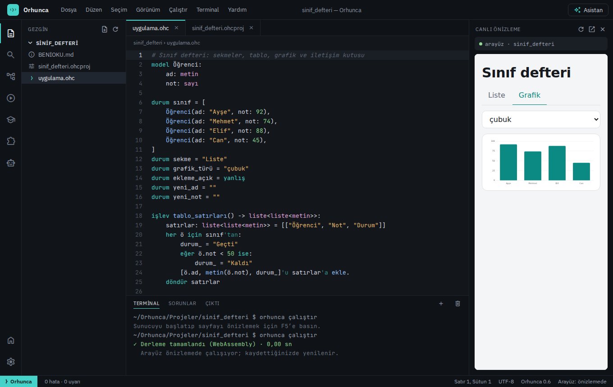
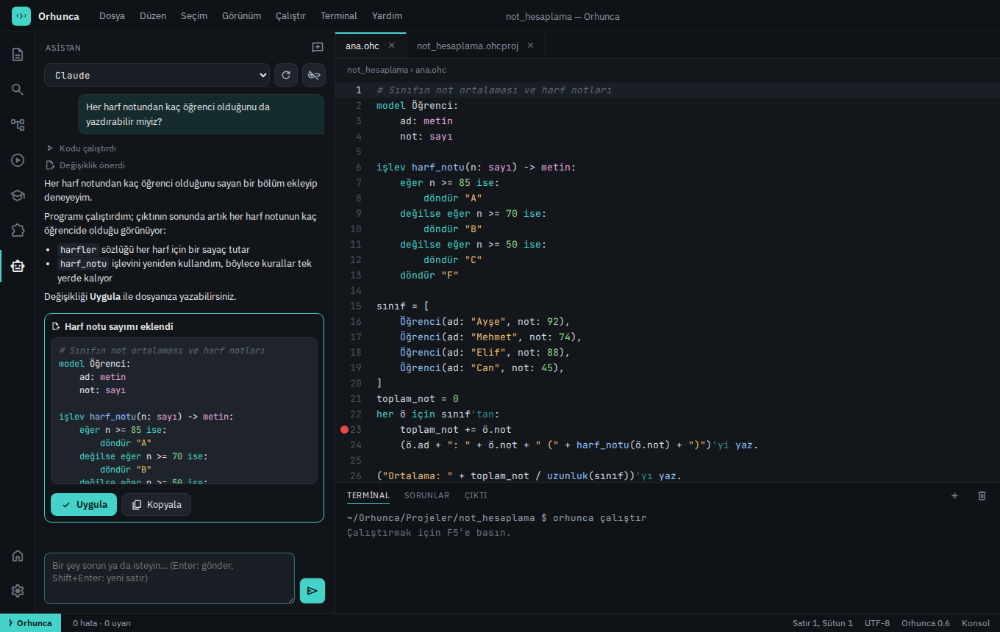

<p align="center">
  <a href="https://furkan003.github.io/Orhunca/">
    <picture>
      <source media="(prefers-color-scheme: dark)" srcset="docs/marka/logo-yatay.svg">
      
    </picture>
  </a>
</p>

<h3 align="center">Türkçe düşün, Türkçe kodla.</h3>

<p align="center">
  Türkçenin hâl ekleriyle yazılan, makine koduna derlenen bir programlama dili<br>
  ve herkes için ücretsiz, Türkçe geliştirme ortamı.
</p>

<p align="center">
  <a href="https://furkan003.github.io/Orhunca/#indir"><b>İndir</b></a> ·
  <a href="https://furkan003.github.io/Orhunca/dene.html"><b>Tarayıcıda dene</b></a> ·
  <a href="https://furkan003.github.io/Orhunca/dersler/"><b>Dersler</b></a> ·
  <a href="docs/dil-rehberi.md">Dil rehberi</a> ·
  <a href="https://furkan003.github.io/Orhunca/basvuru.html">Yerleşik işlevler</a> ·
  <a href="https://github.com/Furkan003/Orhunca/releases">Sürümler</a>
</p>

<p align="center">
  <a href="https://github.com/Furkan003/Orhunca/actions/workflows/ci.yml"></a>
  <a href="https://github.com/Furkan003/Orhunca/releases/latest"></a>
  <a href="https://github.com/Furkan003/Orhunca/releases"></a>
  <a href="LICENSE"></a>
  
</p>

<p align="center">
  
</p>

```orhunca
fiil (kişi: metin)'yi selamla:
    ("Merhaba, " + kişi + "!")'yı yaz.

"Ayşe"'yi selamla.

notlar = [85, 92, 78, 64, 99]
her n için notlar'dan:
    eğer n 90'dan büyükse:
        n'yi yaz.
```

Türkçede olduğu gibi **hâl ekleri** değerin rolünü belirler, **fiil sona** gelir. Öğrenci İngilizce
anahtar kelimeler ezberlemeden programlamanın kendisini öğrenir: değişkenler, koşullar, döngüler,
işlevler, veri yapıları, web ve arayüz.

## Neden Orhunca?

<table>
<tr>
<td width="33%" valign="top">

**Türkçe söz dizimi**<br>
`"Ayşe"'yi selamla.` — ekler ünlü uyumuna göre yazılır, derleyici yanlış eki düzeltmeyi önerir.

</td>
<td width="33%" valign="top">

**Anlaşılır hata mesajları**<br>
Satır ve sütunu gösteren Türkçe mesajlar; `print(...)` gibi başka dillerden gelen alışkanlıklara Orhunca karşılığı, yanlış yazılmış adlara "bunu mu demek istediniz?". Programın Python ve JavaScript karşılığını yan yana görüp başka dillere geçin.

</td>
<td width="33%" valign="top">

**Orhunca Stüdyo**<br>
Dersler ve otomatik denetlenen alıştırmalar, hata ayıklayıcı, adım adım gösterim, tamamlama; renkleri, yazı tiplerini ve GIF arka planı değiştirilebilen, paylaşılabilen temalar.

</td>
</tr>
<tr>
<td valign="top">

**Gerçek programlar**<br>
Cranelift ile doğrudan makine koduna derlenir: tek dosyalık `.exe`, Linux programı, tarayıcı için WebAssembly, kendi penceresinde açılan uygulama ya da Android ve iPhone uygulaması.

</td>
<td valign="top">

**Arayüz ve web**<br>
Düğmeler, tablolar, grafikler ve sekmelerle uygulamalar; oturumlu web siteleri, JSON API'leri ve kalıcı modeller dilin içinde.

</td>
<td valign="top">

**Okullar için**<br>
Ücretsiz ve açık kaynak, hesap ya da veri toplama yok. `.msi` ile toplu kurulum, Pardus için `.deb`, tarayıcıda kurulumsuz deneme.

</td>
</tr>
</table>

## İndir

| Sistem | Orhunca Stüdyo (önerilen) | Yalnızca `orhunca` komutu |
|---|---|---|
| **Windows 10/11** | [Kurulum (.exe)](https://github.com/Furkan003/Orhunca/releases/latest/download/Orhunca-Studyo-Windows-Kurulum.exe) · [MSI (okul/kurumsal)](https://github.com/Furkan003/Orhunca/releases/latest/download/Orhunca-Studyo-Windows.msi) | [.zip](https://github.com/Furkan003/Orhunca/releases/latest/download/orhunca-windows-x86_64.zip) · `irm https://furkan003.github.io/Orhunca/kur.ps1 \| iex` |
| **Pardus, Ubuntu, Debian** | [.deb](https://github.com/Furkan003/Orhunca/releases/latest/download/orhunca-studyo_amd64.deb) · [AppImage](https://github.com/Furkan003/Orhunca/releases/latest/download/Orhunca-Studyo-Linux.AppImage) · [.rpm](https://github.com/Furkan003/Orhunca/releases/latest/download/orhunca-studyo.x86_64.rpm) | [.tar.gz](https://github.com/Furkan003/Orhunca/releases/latest/download/orhunca-linux-x86_64.tar.gz) · `curl -fsSL https://furkan003.github.io/Orhunca/kur.sh \| sh` |
| **Linux ARM64** (Raspberry Pi 4/5) | [.deb](https://github.com/Furkan003/Orhunca/releases/latest/download/orhunca-studyo_arm64.deb) · [.rpm](https://github.com/Furkan003/Orhunca/releases/latest/download/orhunca-studyo.aarch64.rpm) | [.tar.gz](https://github.com/Furkan003/Orhunca/releases/latest/download/orhunca-linux-aarch64.tar.gz) · aynı `kur.sh` |
| **macOS 10.15+** | [.dmg](https://github.com/Furkan003/Orhunca/releases/latest/download/Orhunca-Studyo-macOS.dmg) (Apple işlemcili ve Intel) | [.tar.gz](https://github.com/Furkan003/Orhunca/releases/latest/download/orhunca-macos.tar.gz) |

Stüdyo kurulumları `orhunca` komutunu da kurar ve yeni sürümleri kendisi bildirir. Kurulum
dosyaları henüz imzalı değildir: Windows'ta "Bilinmeyen yayımcı" uyarısında *Ek bilgi → Yine de
çalıştır*, macOS'ta ilk açılışta *sağ tık → Aç*. Kurmadan denemek için:
**[tarayıcıda dene](https://furkan003.github.io/Orhunca/dene.html)**. Bu sayfa telefona ve tablete
uygulama olarak kurulur ve internetsiz çalışır ([telefonda kod yazmak](docs/mobil.md#telefonda-ve-tablette-kod-yazmak)).

## Hızlı başlangıç

1. **Orhunca Stüdyo**'yu kurup açın, **Yeni proje → Konsol Uygulaması** seçin.
2. `ana.ohc` dosyasına yazın: `"Merhaba, dünya!"'yı yaz.`
3. **F5**'e basın. Program derlenir ve çıktısı alttaki terminalde görünür.

Sonra sol çubuktaki **Dersler** panelinden ilk derse başlayın. Komut satırını tercih ederseniz:

```sh
orhunca çalıştır merhaba.ohc       # derle ve çalıştır
orhunca derle merhaba.ohc          # tek dosyalık program (Windows'ta .exe)
orhunca derle sayaç.ohc --hedef web   # tarayıcıda çalışan sayfa
orhunca etkileşim                  # satır satır deneme
```

## Neler yapılabilir?

<table>
<tr>
<td width="50%" valign="top">

**Arayüz uygulamaları** — [rehber](docs/arayuz.md)

```orhunca
durum sayaç = 0

arayüz:
    başlık("Sayaç: " + sayaç)
    düğme("Artır") tıklanınca:
        sayaç += 1
```

</td>
<td width="50%" valign="top">



</td>
</tr>
<tr>
<td valign="top">

**Web siteleri ve API'ler** — [rehber](docs/dil-rehberi.md#web-sunucusu)

```orhunca
model Ürün:
    ad: metin, zorunlu, en_fazla 80
    fiyat: ondalık, en_az 0

al "/ürünler":
    döndür görünüm("ürünler", Ürün.hepsi())
```

</td>
<td valign="top">


</td>
</tr>
<tr>
<td valign="top">

**Hata ayıklama** — [Stüdyo rehberi](docs/studyo.md)

Kesme noktaları, değişkenler, çağrı yığını; ya da **adım adım gösterim** ile programın satır
satır çalışmasını sınıfta izleyin.

</td>
<td valign="top">


</td>
</tr>
<tr>
<td valign="top">

**Yapay zekâ** — [rehber](docs/yapay-zeka.md)

Stüdyo'daki asistan Claude, GPT, Gemini gibi bulut modelleriyle ya da Ollama, LM Studio gibi yerel modellerle çalışır: soruları yanıtlar, kod yazar, yazdığı kodu
denetleyip çalıştırır; değişikliği siz onaylarsınız. Claude Code, Codex, Gemini CLI, Cursor gibi ajanlar
`orhunca mcp` sunucusuna bağlanıp Orhunca kodu yazabilir. Okullar asistanı tek ayarla kapatabilir.

</td>
<td valign="top">



</td>
</tr>
<tr>
<td valign="top">

**Dersler** — [sitede oku](https://furkan003.github.io/Orhunca/dersler/)

İlk programdan web'e 13 ders. Her alıştırma Stüdyo'da çalıştırılıp çıktısıyla denetlenir.

</td>
<td valign="top">


</td>
</tr>
</table>

Kütüphane: metin ve liste işlemleri, dosyalar, matematik, tarih hesapları, desenler (düzenli
ifadeler), CSV, JSON, HTTP istekleri; resmi `istatistik` ve `geometri` paketleri
(`orhunca paket ekle istatistik`). Ayrıntılar: [dil rehberi](docs/dil-rehberi.md#standart-kütüphane).

## Belgeler

| | |
|---|---|
| [Dersler](dersler) | Adım adım, alıştırmalı Türkçe dersler |
| [Dil rehberi](docs/dil-rehberi.md) | Söz dizimi, hâl ekleri, modeller, web, standart kütüphane |
| [Yerleşik işlevler](docs/basvuru.md) | Bütün yerleşik işlevler bölüm bölüm ([aranabilir sayfa](https://furkan003.github.io/Orhunca/basvuru.html), terminalde `orhunca başvuru tarih`) |
| [Arayüz dili](docs/arayuz.md) | `durum`, `arayüz:`, öğeler ve olaylar; masaüstüne paketleme |
| [Orhunca Stüdyo](docs/studyo.md) | Geliştirme ortamı, hata ayıklayıcı, canlı önizleme |
| [Oyun yapmak](docs/oyun.md) | `oyun_alanı`, çizim, klavye, fare ve dokunma, ses |
| [Sunucuya yayınlamak](docs/yayinlama.md) | `orhunca yayınla`: VPS'e kurmak, alan adı ve HTTPS; paylaşımlı hosting (cPanel) ve `.ohc` dosyalarını PHP gibi çalıştırmak |
| [Telefon uygulamaları](docs/mobil.md) | Android (.apk) ve iPhone/iPad; `titret`, `paylaş`, `bildirim_gönder` |
| [Yapay zekâ](docs/yapay-zeka.md) | Stüdyo asistanı (bulut ve yerel modeller); Claude Code, Codex, Cursor gibi ajanları `orhunca mcp` ile bağlamak |
| [Geriye uyumluluk](docs/uyumluluk.md) | Güncellemelerde programların bozulmaması, dil sürümü, `orhunca düzelt` |
| [Deneme listesi](docs/deneme-listesi.md) | Gerçek cihazlarda (Windows, telefon, yapay zekâ) adım adım deneme |
| [Paketler](docs/paketler.md) | Paket dizini, `orhunca paket`, kendi paketinizi yayımlamak |
| [Geliştirme](docs/gelistirme.md) | Kaynaktan derleme, mimari, öz-barındırma, VS Code eklentisi |
| [Yol haritası](PLAN.md) | Tamamlanan aşamalar ve sıradakiler |

## Katkı

Hata bildirimleri, ders ve örnek önerileri, paketler ve kod katkıları memnuniyetle karşılanır:
[katkı rehberi](CONTRIBUTING.md) · [hata bildir](https://github.com/Furkan003/Orhunca/issues/new/choose) ·
[davranış kuralları](CODE_OF_CONDUCT.md) · [güvenlik](SECURITY.md).

## Adı nereden geliyor?

Orhun Yazıtları (8. yüzyıl), Türkçenin bilinen en eski yazılı metinleridir. Logodaki ‹𐰆›
Göktürk alfabesinden bir harftir: Türkçe yazının ilk izlerinden programlamaya.

## Lisans

Orhunca [MIT lisansı](LICENSE) ile dağıtılır: okullar, öğrenciler ve herkes ücretsiz
kullanabilir, değiştirebilir ve paylaşabilir. Tek koşul, kodun kopyalarında ya da önemli
parçalarında telif satırının (Orhunca'nın yaratıcısı Furkan, [github.com/Furkan003](https://github.com/Furkan003))
ve lisans metninin korunmasıdır.
