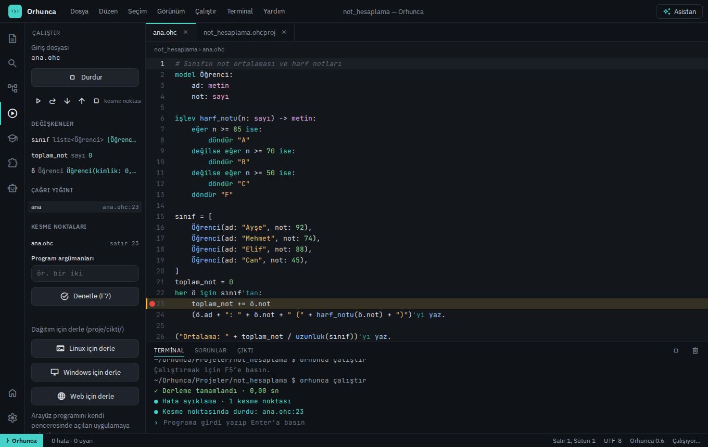
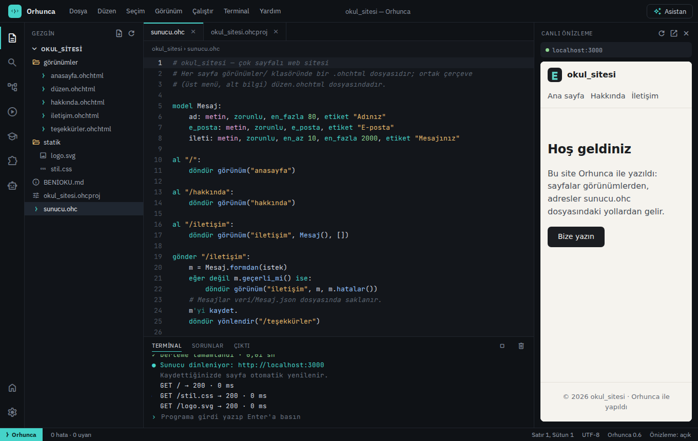
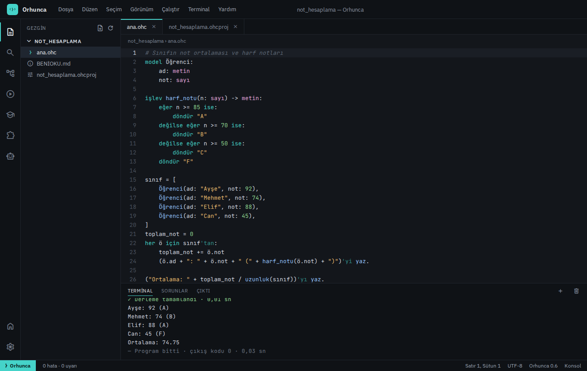
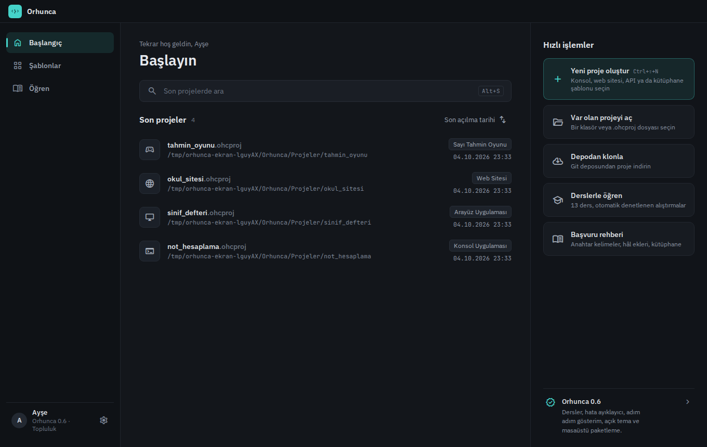
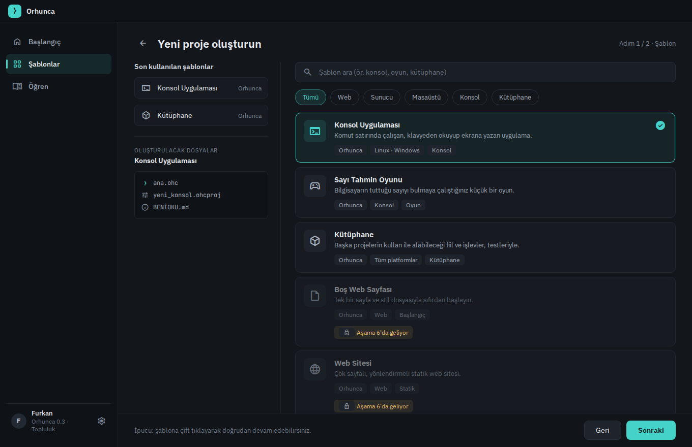
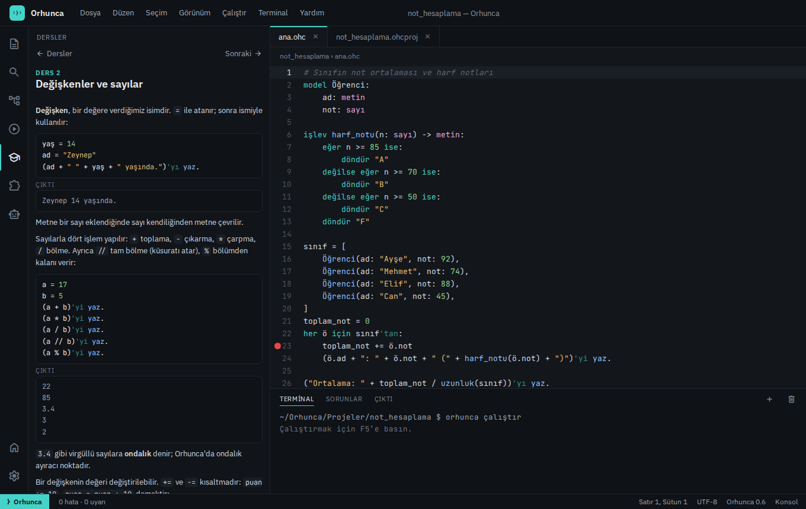
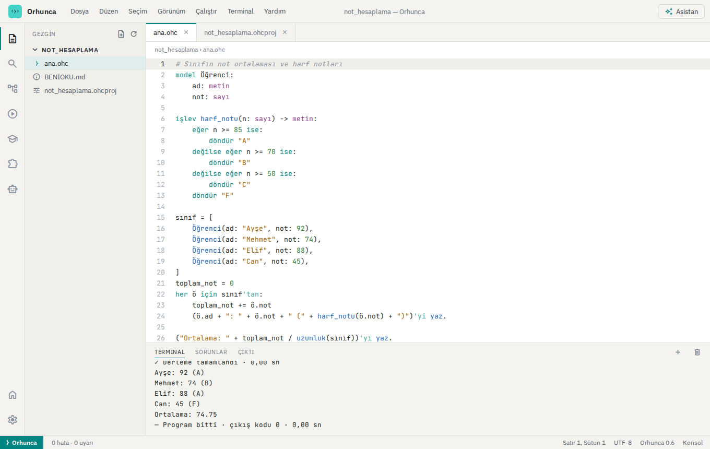
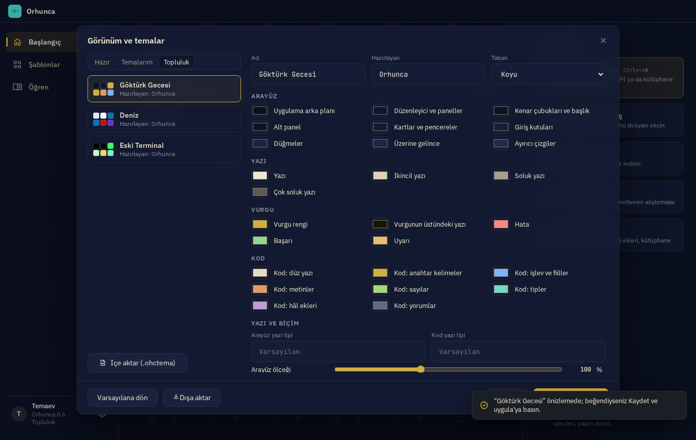

# Orhunca Stüdyo

Türkçe geliştirme ortamı.

[← README](../README.md)


```sh
orhunca stüdyo
```

Tarayıcıda Orhunca'nın geliştirme ortamını açar: son projeler, şablon sihirbazı (Konsol Uygulaması,
Sayı Tahmin Oyunu, Kütüphane; Boş Web Sayfası, Web Sitesi, Web Uygulaması, Açılış Sayfası, Web API,
Tam Yığın Uygulama; Arayüz Uygulaması), sözdizimi renklendirmeli düzenleyici (`.ohc`, `.ohchtml`, CSS, JavaScript),
yazarken hata gösterimi, F5 ile derleyip çalıştırma (programın girdisi terminalden verilir),
kesme noktalı hata ayıklayıcı, Linux/Windows için dağıtım derlemesi ve masaüstü paketleme ve Türkçe anahtar kelime rehberi. İnternet gerekmez; arayüz ve
yazı tipleri ikili dosyanın içindedir.

**Otomatik kaydetme ve yerel geçmiş:** yazmaya ara verdiğinizde dosya kendiliğinden kaydedilir
(Ayarlar → Otomatik kaydet ile kapatılabilir). Kaydedilen her dosyanın önceki hâlleri proje
klasörünün dışında, ayar klasöründe saklanır (dosya başına en çok 100 kayıt, 30 gün; bir dakika
içindeki kayıtlar birleşir). **Dosya → Yerel geçmiş…** ile bir hâli seçip önizleyebilir ve
**Bu hâle dön** ile geri getirebilirsiniz (Ctrl+Z ile geri alınır). Kaydetme başarısız olursa
program çalıştırılmaz; ekrandaki kod ile çalışan kod her zaman aynıdır.

Web projelerinde F5 sunucuyu başlatır ve sayfa sağdaki **canlı önizlemede** açılır. Kaydettiğinizde
sunucu yeniden derlenir ve önizleme bulunduğu adreste yenilenir (yalnızca `statik/` dosyası
değiştiyse sayfa yenilenir). Stüdyo kapanınca başlattığı sunucular da kapanır. Arayüz
uygulamalarında F5 programı WebAssembly'ye derler ve uygulama önizlemede (Stüdyo'dan yalıtılmış bir
çerçevede) çalışır; kaydettiğinizde yeniden derlenir.

**Hata ayıklama:** satır numarasına tıklayarak (ya da F9) kesme noktası koyun, F6 ile programı
hata ayıklayarak başlatın. Program kesme noktasında durur; durulan satır vurgulanır, yan panelde
o anki **değişkenler** (tipleri ve değerleriyle; listeler, sözlükler ve modeller dahil) ve **çağrı
yığını** görünür; yığındaki bir işleve tıklayınca onun değişkenleri gösterilir. F5 devam, F10
üstünden adım, F11 içine adım, ⇧F11 dışına adım; çalışırken *Duraklat* ile program bulunduğu
yerde durdurulur ve kesme noktaları program çalışırken de eklenip kaldırılabilir. Yakalanmamış
bir çalışma hatasında program kapanmadan önce hatanın olduğu satırda durur.







| Başlangıç | Yeni proje |
|---|---|
|  |  |
| Dersler | Açık tema |
|  |  |

**Öğrenme:** sol çubuktaki **Dersler** paneli [dersler/](../dersler) klasöründeki 13 dersi açar
(ilk programdan web'e). Her dersin alıştırması *Başla* ile bir dosya olarak açılır, *Denetle*
programı çalıştırıp çıktısını beklenenle karşılaştırır; tamamlanan dersler işaretlenir. Dersler
web sitesinde de okunabilir.

**Kolaylıklar:** yazarken tamamlama (Ctrl+Boşluk; kesme işaretinden sonra ifadenin doğru hâl eki
önerilir: `sayılar'` → `'ı`), **adım adım gösterim** (program her satırda kendiliğinden durup ilerler,
değişkenler güncellenir; sınıfta göstermek için), Ayarlar'da **açık tema** (projektör için), klavyeyle
tam kullanım ve ekran okuyucu desteği.

**Türkçe klavyesi olmayanlar için:** `Alt+C`, `Alt+G`, `Alt+I`, `Alt+O`, `Alt+S`, `Alt+U` tuşları
ç, ğ, ı, ö, ş, ü yazar (Shift ile büyük harf: Ç Ğ İ Ö Ş Ü). Türkçe harfsiz yazılan anahtar
kelimeler ve yerleşik işlevler kelime bitince kendiliğinden düzelir (`eger ` → `eğer `,
`degilse:` → `değilse:`); metinlere, yorumlara ve sizin tanımladığınız isimlere dokunulmaz, Ctrl+Z
düzeltmeyi geri alır. Tamamlama da harfsiz yazımı tanır: `deg` yazınca `değilse` önerilir. Alt
kısayolları tarayıcıda deneme sayfasında da çalışır.

**Güncelleme:** Stüdyo açılışta yeni sürüm olup olmadığına bakar; varsa başlangıç ekranından tek
tıkla güncellenir (dosya SHA-256 ile doğrulanır). Komut satırında: `orhunca güncelle`. Okul
yöneticileri denetimi `ORHUNCA_GUNCELLEME=kapali` ortam değişkeniyle kapatabilir; Ayarlar'dan da
kapatılabilir.

**Etkileşim (REPL):** `orhunca etkileşim` satır satır deneme ortamı açar: `3 + 4` yazınca `7`,
tanımlar ve atamalar oturumda kalır, `:yardım`, `:liste`, `:sil`, `:çık`.

**Masaüstü uygulaması:** [masaustu/](../masaustu) Stüdyo'yu tarayıcısız, kendi penceresinde açan Tauri
uygulamasıdır (`cd masaustu && cargo run --release`; kurulum dosyaları için `cargo tauri build`).

Sunucu yalnızca `127.0.0.1` üzerinden erişilebilir ve her oturumda rastgele bir anahtar üretir;
başka web sitelerinin dosyalarınıza ya da derleyiciye erişmesi engellenir. Tasarım kaynağı:
[docs/tasarim/](tasarim/).

## Başka dillerde (Python ve JavaScript)

*Görünüm → Python karşılığını göster* (ya da Çalıştır panelindeki düğme), açık programın Python ya
da JavaScript karşılığını satır satır eşleşmiş olarak yan yana gösterir. Orhunca ile başlayan
öğrenci aynı kavramların başka dillerde nasıl yazıldığını görür. Komut satırında:
`orhunca çevir dosya.ohc --dil python` (ya da `--dil javascript`).

Arayüz bölümleri, web yolları ve model kayıt işlemleri Orhunca'ya özeldir; çeviride bunlar için
açıklama yazılır.

## Yapay zekâ asistanı

Sağ üstteki **Asistan** düğmesi (<kbd>Ctrl+I</kbd>), Claude, GPT, Gemini ya da yerel modellerle (Ollama, LM Studio) çalışan bir
sohbet panelini sağda açar. Asistan açık dosyanızı görür, yazdığı kodu denetleyip çalıştırır ve dosya değişikliğini
öneri olarak gösterir; **Uygula** ile yazılır. Ayrıntılar ve okullar için kapatma ayarı:
[Yapay zekâ ile Orhunca](yapay-zeka.md).

## Görünüm ve temalar

*Ayarlar → Görünüm ve temalar* Stüdyo'nun her rengini, yazı tiplerini, arayüz ölçeğini ve köşe
yuvarlaklığını değiştirir; değişiklikler anında görünür.

- **Hazır temalar:** Orhunca Koyu ve Açık, Gece Mavisi, Mor Gece, Kuzey, Orman, Gün Batımı, Kâğıt,
  Yüksek Karşıtlık (az gören öğrenciler ve projektör için).
- **Arka plan:** resim, hareketli GIF ya da kısa video (MP4/WebM, en çok 22 MB). Panellerin
  saydamlığı, resmin bulanıklığı ve karartması ayarlanır.
- **Kod renkleri:** anahtar kelimeler, işlevler, metinler, sayılar, tipler, hâl ekleri, yorumlar.
- **Paylaşma:** *Dışa aktar* temayı (arka plan resmiyle birlikte) tek bir `.ohctema` dosyasına
  yazar; alan kişi *İçe aktar* ile açar. *Topluluk* sekmesi depodaki [temalar/](../temalar)
  galerisini gösterir; kendi temanızı oraya bir çekme isteğiyle ekleyebilirsiniz.
- **Gelişmiş:** özel CSS. Paylaşılan temalar dış adres yükleyemez (`@import`, `http` adresleri).

Kaydedilen temalar ayar klasöründedir (Linux `~/.config/orhunca/temalar`, Windows
`%APPDATA%\Orhunca\temalar`).



