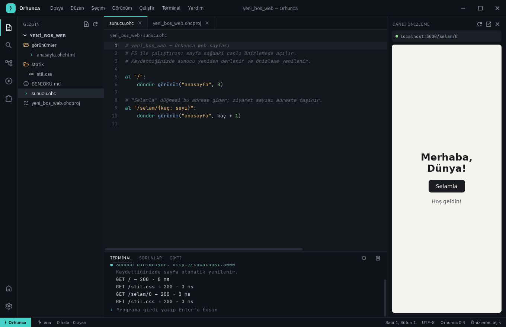

# Orhunca Stüdyo — masaüstü uygulaması

Orhunca Stüdyo'yu tarayıcı gerektirmeyen, kendi penceresinde açılan bir masaüstü uygulaması
olarak paketler ([Tauri 2](https://tauri.app)). Arayüz `orhunca stüdyo` ile aynıdır
(`studio/` klasörü); uygulama Stüdyo'nun yerel sunucusunu kendi içinde başlatır ve pencerede
gösterir. Pencere çerçevesizdir: başlık çubuğu ve küçült/büyüt/kapat düğmeleri Stüdyo
arayüzündedir, başlık çubuğundan sürüklenir.



## Çalıştırma ve paketleme

```sh
cd masaustu
cargo run --release                  # geliştirme sırasında doğrudan çalıştırma
cargo install tauri-cli --version "^2" --locked
cargo tauri build                    # kurulum dosyaları: target/release/bundle/
```

| Sistem | Gerekenler | Çıktı |
|---|---|---|
| Linux | `libwebkit2gtk-4.1-dev libgtk-3-dev librsvg2-dev libayatana-appindicator3-dev libxdo-dev` | `orhunca-studyo_1.1.0_amd64.deb`, `.AppImage`, `.rpm` |
| Windows | WebView2 (Windows 10/11'de hazır) | `.msi`, kurulum `.exe` |
| macOS (deneysel) | Xcode komut satırı araçları | `.app`, `.dmg` |

GitHub'da **Sürüm** iş akışı (`.github/workflows/surum.yml`) üç sistem için kurulum
dosyalarını üretir ve `v*` etiketlerinde GitHub sürümü olarak yayımlar. Sürüm kurulumları
`orhunca` komutunu da içerir (`tauri.surum.conf.json`, `externalBin`):

- **Windows:** kurulum `.exe` (NSIS, Türkçe) ve `.msi`; `orhunca` komutu PATH'e eklenir
  (`windows/kurulum.nsh`, `windows/yol.wxs`).
- **Linux:** `.deb` (`/usr/bin/orhunca` da kurulur), `.AppImage`, `.rpm`.
- **macOS:** `.dmg` (Apple işlemcili ve Intel).

Her sürüm dosyası için GitHub'ın imzalı derleme kanıtı (build provenance) oluşturulur ve
`SHA256SUMS.txt` eklenir. Sürüm yayımlandıktan sonra paket yöneticisi bildirimleri
güncellenir: `python3 araclar/dagitim_bildirimleri.py vX.Y.Z` (Scoop `bucket/`, Homebrew
`Formula/`, winget `kurulum/winget/`); winget bildirimi microsoft/winget-pkgs deposuna çekme
isteğiyle gönderilir (`wingetcreate submit kurulum/winget/X.Y.Z`).

`.ohc` ve `.ohcproj` dosyaları Stüdyo ile ilişkilendirilir; çift tıklanan dosyanın projesi açılır.

## Kullanıcının bilgisayarında

C derleyicisi gerekmez (Linux ve Windows). macOS'ta konsol programlarını derlemek için Xcode
komut satırı araçları gerekir (`xcode-select --install`); arayüz ve web programları
gerektirmez.

## Nasıl çalışır

- `src/main.rs`: `orhunca::studyo::arka_planda_baslat(0)` boş bir kapıda Stüdyo sunucusunu başlatır
  ve oturum anahtarlı adresi verir; pencere bu adresi açar.
- `capabilities/studyo.json`: yerel sunucudan yüklenen arayüzün yalnızca pencereyi küçültme,
  büyütme, kapatma ve sürükleme izni vardır.
- Uygulama kapanınca Stüdyo'dan çalıştırılan programlar (ör. web sunucuları) da durdurulur.
- "Önizlemeyi tarayıcıda aç" sistemin varsayılan tarayıcısını kullanır.
- Linux paket adı ASCII olmak zorunda olduğundan `tauri.linux.conf.json` paketi `orhunca-studyo`
  adıyla üretir; menüde görünen ad (`orhunca-studyo.desktop`) yine "Orhunca Stüdyo"dur.
